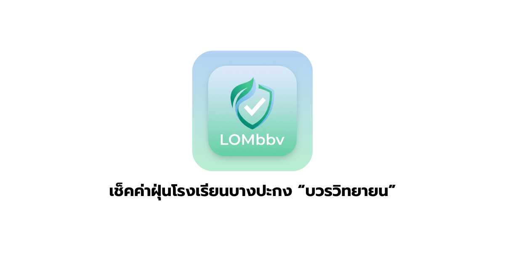

# LOMbbv - Air Quality & Weather Monitoring System 🌤️🍃

**LOMbbv** (ลม-บวรวิทยายน) is a modern, real-time air quality and weather monitoring dashboard designed for **Bang Pakong Bowon Witthayayon School**. Built with Next.js 16 and a stunning Glassmorphism UI, it helps students and staff stay informed about PM2.5 levels and weather conditions.



## ✨ Features

- **Real-Time Monitoring**: Fetches live data (PM2.5, Temperature, Humidity, Wind) from KidBright IoT sensors.
- **Glassmorphism UI**: A premium, clean, and responsive design with dynamic background animations.
- **Interactive Visualizations**:
  - Large AQI Gauge for instant status checks.
  - Sparkline charts for weather trends.
  - **History Section**: 7-day trend analysis and detailed data logs.
- **Bilingual Support (i18n)**: One-click toggle between **Thai 🇹🇭** and **English 🇬🇧**.
- **Health Recommendations**: Smart advice logic based on current air quality levels.
- **LINE Notifications**: Automated alerts sent to LINE when PM2.5 levels reach unhealthy thresholds.
- **PWA Support**: Installable as a native-like app on iOS and Android.
- **Admin Dashboard**: Secure manual control for system status and notification triggers.
- **Security**: Server-side authentication and environment variable protection for secrets.

## 🛠️ Tech Stack

- **Framework**: [Next.js 16](https://nextjs.org/) (App Directory)
- **Language**: TypeScript
- **Styling**: Tailwind CSS (v4), CSS Modules
- **Charts**: Recharts
- **Icons**: Lucide React
- **Deployment**: Vercel (Recommended)

## 🚀 Getting Started

### 1. Clone the repository
```bash
git clone https://github.com/MarkeloPuangpoo/lombbv.git
cd lombbv
```

### 2. Install dependencies
```bash
npm install
```

### 3. Configure Environment Variables
Create a `.env.local` file in the root directory and add the following secrets:

```env
# LINE Messaging API Token (Channel Access Token)
LINE_ACCESS_TOKEN=your_long_term_access_token_here

# Admin Dashboard Password
ADMIN_PASSWORD=your_secure_password

# Target User ID for LINE Alerts (for testing/admin alerts)
LINE_USER_ID=Uxxxxxxxxxxxxxxxxxxxxxxxxxxxx
```

### 4. Run Development Server
```bash
npm run dev
```
Open [http://localhost:3000](http://localhost:3000) to view the app.

## 📁 Project Structure

```
src/
├── app/
│   ├── api/             # API Routes (Alerts, Weather, History, Auth)
│   ├── admin/           # Admin Dashboard Page
│   ├── layout.tsx       # Root Layout & SEO Metadata
│   └── page.tsx         # Main Dashboard (Home)
├── components/
│   ├── dashboard/       # Dashboard Widgets (Gauge, WeatherGrid, History)
│   └── ...              # Shared Components
├── lib/
│   ├── translations.ts  # i18n Dictionary
│   └── utils.ts         # Helper functions
└── ...
```

## 🔒 Security

- **Safe Secrets**: Sensitive keys (`LINE_ACCESS_TOKEN`, `ADMIN_PASSWORD`) are never exposed to the client.
- **Secure API**: The Admin Login uses a server-side route (`/api/auth/login`) to verify credentials without leaking logic to the browser.

## 👨‍💻 Credits

Designed and Developed by **Student Council of Bang Pakong Bowon Witthayayon School**.

---
*Powered by KidBright & Next.js*
